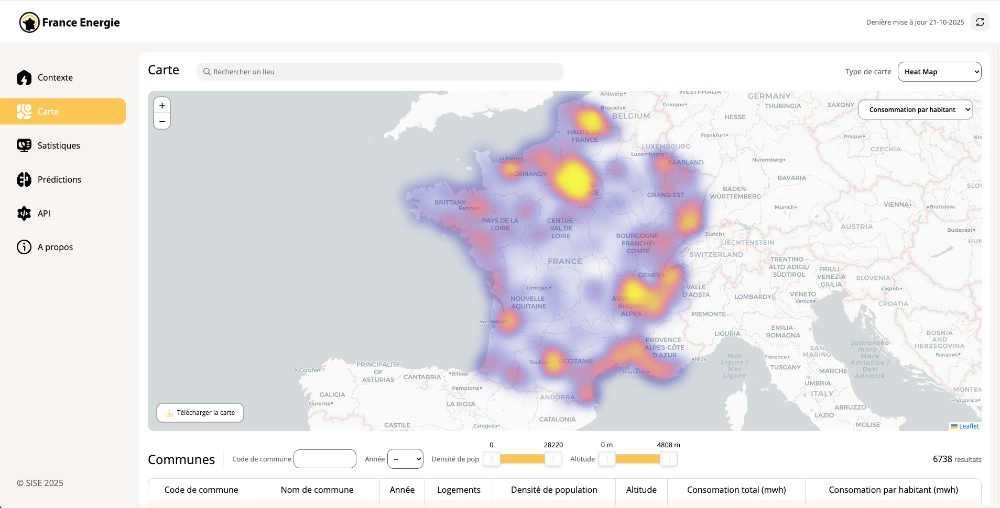

# M2 SISE - Enedis
> [!NOTE]
> Ce travail est un projet scolaire réalisé dans le cadre de ma 2ème année de Master en SISE.

 

## La web-app
### 🔗 Live : [France Energie](https://france-energie.koyeb.app/)
Visualisez la consommation des Français sur une carte et à l'aide de graphiques interactifs, en utilisant les données de l'API de **l'ADEME** et d'**Enedis**. Prédiction de la consommation et de l'étiquette DPE d'un logement grâce à un modèle de régression et de classification.
  

## Structure du projet
