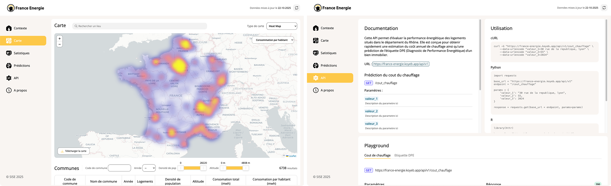

# M2 SISE - Enedis
> [!NOTE]
> Ce travail est un projet scolaire réalisé dans le cadre de ma 2<sup>ème</sup> année de Master en SISE.

<br>

## Présentation
### 🔗 Live : [France Energie](https://france-energie.koyeb.app/)
Visualisez la consommation des Français sur une carte et à l'aide de graphiques interactifs, en utilisant les données de l'API de **l'ADEME** et d'**Enedis**. Prédiction de la consommation et de l'étiquette DPE d'un logement grâce à un modèle de régression et de classification.
<br><br>


<br>

## Technologies utilisées
- Backend : **Python** + **Flask**
- Frontend : **HTML** + **CSS** + **JS**
- Carte : **Leaflet** + plugins
- Graphiques : **Plotly**
- Gestion des données : **Pandas**
- Création des modèles : **scikit-learn**
- Déploiement : **Docker** + **Koyeb**

<br>

## Sources de données
Les données utilisées par l'application proviennent des APIs de l'[ADEME](https://data.ademe.fr/datasets/dpe03existant/api-doc) et d'[Enedis](https://data.enedis.fr/explore/dataset/consommation-annuelle-residentielle-par-adresse/api/). La base de données data.gouv [communes de France 2025](https://www.data.gouv.fr/datasets/communes-et-villes-de-france-en-csv-excel-json-parquet-et-feather/) est également exploitée.

<br>

## 🏔️ Analyse Complémentaire : Mountain Energy Score - Haute-Savoie

Ce dépôt contient également une analyse détaillée de l'impact de l'altitude sur la consommation énergétique des logements en Haute-Savoie (département 74).

### 📊 Résultats Clés
- **+8,5 kWh/m²/an** de consommation par 100m d'altitude supplémentaire
- **61,3%** des logements situés en vallée (< 600m)
- **72,9%** des logements en classe énergétique C ou D

### 📁 Structure de l'Analyse

Les scripts d'analyse se trouvent à la racine du projet :
- `01_preparation_donnees.py` - Préparation et nettoyage des données
- `02_graphique_scatter.py` - Régression altitude × consommation
- `03_graphique_boxplot.py` - Distribution par tranche d'altitude
- `04_graphique_barplot.py` - Consommation moyenne par altitude
- `05_graphique_barres_dpe.py` - Répartition des étiquettes DPE
- `06_graphique_periode_construction.py` - Évolution temporelle
- `99_regenerer_tout.py` - Régénère tous les graphiques

### 🚀 Utilisation de l'Analyse

```bash
# Installer les dépendances pour l'analyse
pip install -r requirements.txt

# Préparer les données
python 01_preparation_donnees.py

# Générer tous les graphiques
python 99_regenerer_tout.py

# Consulter le rapport
# Ouvrir graphiques/mountain_energy_score_rapport_complet.html
```

<br>

## Exécuter l'app web en local

1. Aller dans le dossier `web`
```bash
cd web
```

2. Installer les dépendances
```bash
pip install -r requirements.txt
```

3. Créer un dossier pour stocker le volume et renseigner son emplacement dans la variable d'environnement `MOUNT_PATH`
> macOS / linux
```bash
mkdir volume
export MOUNT_PATH="volume"
```
> Windows
```bash
mkdir volume
set MOUNT_PATH="volume"
```

4. Lancer l'app
```bash
python app.py
```

5. L'application est hébergée sur le port `8000`, ouvrir un navigateur et se rendre à l'adresse http://0.0.0.0:8000/

<br>

## Crédits

Au-delà des outils et bibliothèques utilisés, ce projet est rendu possible grâce aux projets open source suivants :
- [Leaflet.heat](https://github.com/Leaflet/Leaflet.heat) par [@jxn-30](https://github.com/jxn-30)
- [Leaflet.markercluster](https://github.com/Leaflet/Leaflet.markercluster) par [@eriknikulski](https://github.com/eriknikulski)
- [dom-to-image](https://github.com/tsayen/dom-to-image) par [@tsayen](https://github.com/tsayen)
