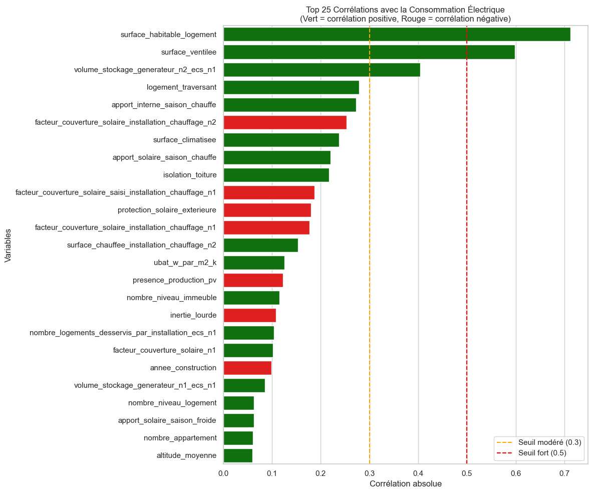
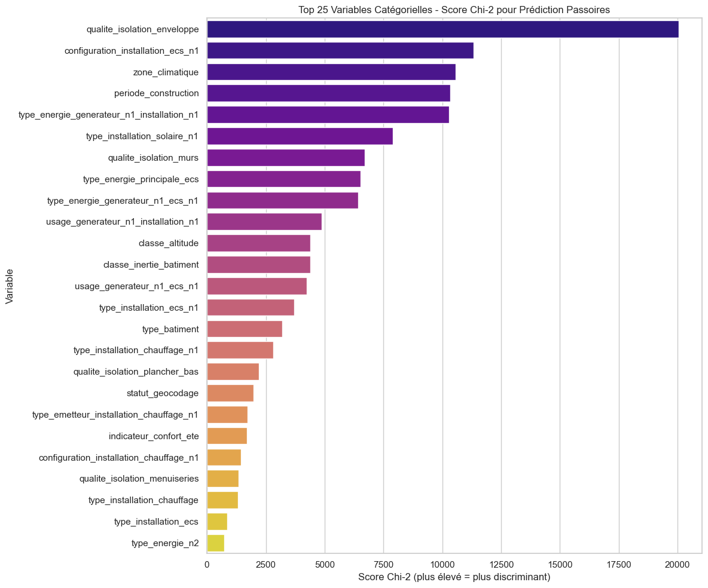
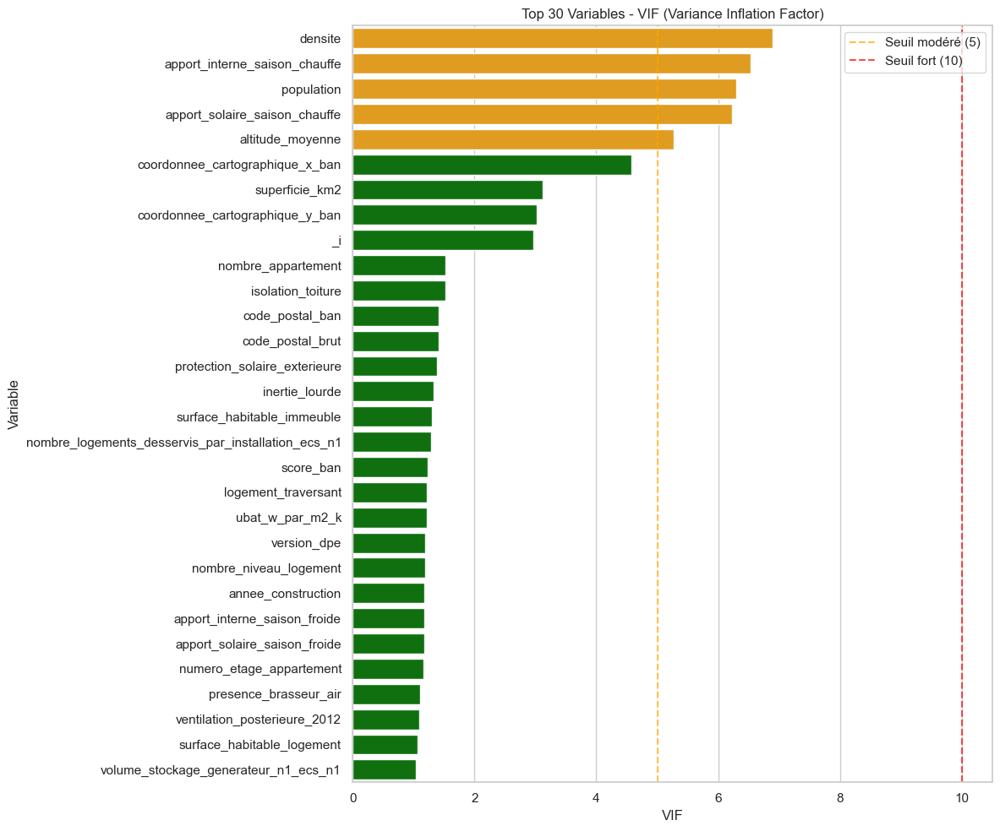
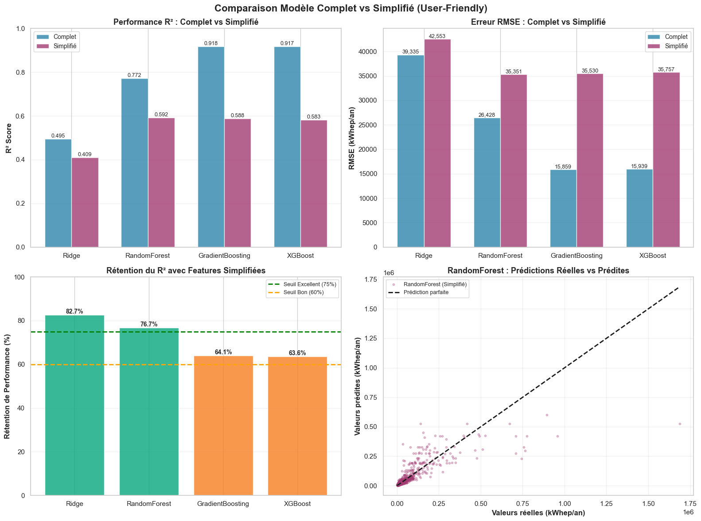
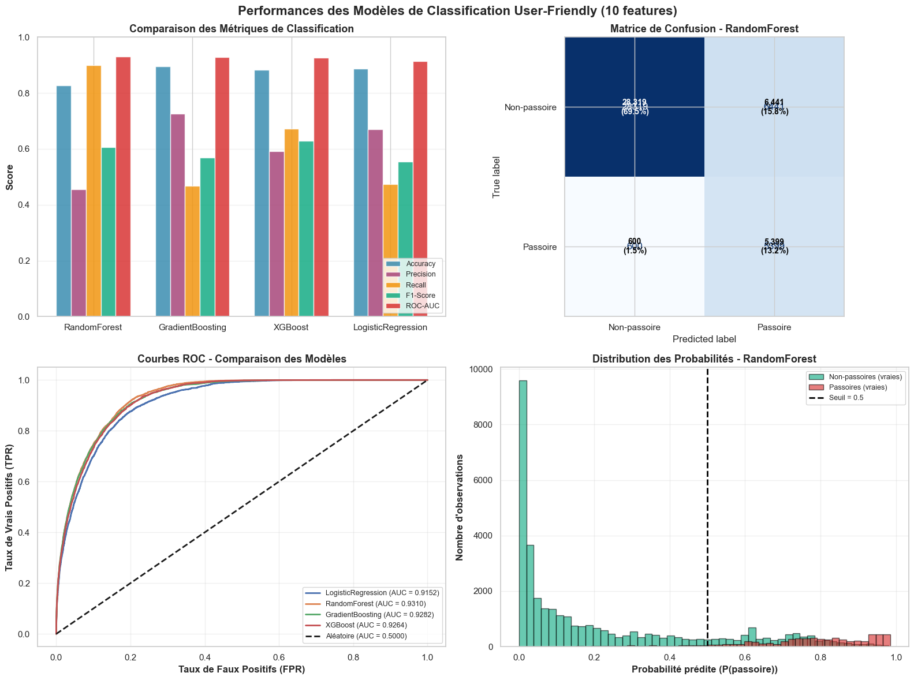

# Rapport sur les modèles de Machine Learning employés lors du projet 

## 1. Introduction et Contexte

### 1.1 Objectif du projet

Ce projet vise à développer une application web permettant de **prédire la performance énergétique des logements** en Haute-Savoie (département 74) ainsi qu'essayer de prédire le Diagnostic de Performance Énergétique (DPE). L'application doit fournir deux types de prédictions :

1. **Régression** : Estimation de la consommation énergétique annuelle kWhep/an
2. **Classification** : Détection des "passoires énergétiques" (logements classés F ou G)

### 1.2 Contraintes du projet

L'application web impose d'utiliser un modèle de machine learning avec des contraintes spécifiques :

- **Simplicité d'utilisation** : Difficile de demander trop d'informations techniques à l'utilisateur
- **Rapidité de saisie** : Limiter ainsi le nombre de questions posées à l'utilisateur
- **Accessibilité des données** : Utiliser uniquement des informations que l'utilisateur connaît sans expertise technique ou les apporter via des calculs simples
- **Performance prédictive** : Maintenir une bonne précision malgré la réduction des features

### 1.3 Dataset

<!-- A faire revoir par Marin sur les précisions à apporter -->
- **Source** : `logements_74.csv` - Données issues de l'API de l'ADEME (Agence de la transition écologique) enrichies avec des données géographiques
- **Taille** : 203 792 observations (logements)
- **Variables initiales** : 236 colonnes
- **Cible régression** : `conso_5_usages_ep` (consommation énergétique en kWhep/an)
- **Cible classification** : `passoire` (variable binaire : 1 si DPE F/G, 0 sinon)
---

## 2. Méthodologie de construction des modèles

### 2.1 Sélection des variables

La sélection des features a été réalisée en deux phases distinctes.

#### **Phase 1 : Sélection statistique (36 features)**

Dans un premier temps, avec un jeu de données contenant 236 variables, une première séléction "théorique" a été effectuée en utilisant des méthodes statistiques classiques
ce qui a permis de réduire le nombre de variables à 36. certaines variables utilisés directement ou indirectement pour le calcul du DPE on été écartés également afin d'éviter le **data leakage**.
ensuite, ces 36 variables ont servi de base pour établir une performance de référence pour les modèles.
une fois cette étape réalisée, les variables ont été réduites d'avantage pour se limiter a des features plus "user-friendly" pour l'application web.

**a) Analyse de corrélation**
- **Seuil appliqué** : |r| > 0.10 avec la cible
- **Objectif** : Identifier les variables linéairement liées à la consommation énergétique
- Variables hautement corrélées : isolation, énergie de chauffage, surface, période de construction



**b) Test du Chi-2 pour variables catégorielles**
- **Test statistique** : Chi-2 d'indépendance
- **Seuil de significativité** : p-value < 0.05
- **Objectif** : Valider la dépendance statistique entre variables qualitatives et la cible
- Exemples : type de bâtiment, zone climatique, type d'énergie




**c) Calcul du VIF (Variance Inflation Factor)**
- **Objectif** : Éliminer la multicolinéarité entre prédicteurs, puisque beaucoup des variables du jeux de données sont interconnectés.
- **Seuil appliqué** : VIF < 10
- **Résultat** : Exclusion de variables redondantes (ex : 'surface_chauffee_installation_chauffage_n1',
'surface_habitable_desservie_par_installation_ecs_n1'
qui sont dans la majeure partie des cas extremement proche de la surface du logement elle même)



**Résultat Phase 1** : 36 features sélectionnées, performance de référence établie

#### **Phase 2 : Réduction supplémentaire des variables (9 features)**

Pour l'application web, une sélection plus drastique a été nécessaire en privilégiant :

**Critères de sélection** :
1. **Compréhensibilité** : Variable compréhensible par un utilisateur non-expert
2. **Disponibilité** : Information connue sans mesure technique
3. **Impact prédictif** : Contribution significative aux modèles (feature importance)
4. **Non-redondance** : Pas de duplication d'information

**Features retenues (9 au total)** :
| Feature | Type | Source | Exemple |
|---------|------|--------|---------|
| `surface_habitable_logement` | Numérique | Saisie utilisateur | 75.0 |
| `periode_construction` | Catégorielle | Saisie utilisateur | `1975-1989` |
| `type_batiment` | Catégorielle | Saisie utilisateur (type bâtiment) | `appartement` |
| `qualite_isolation_enveloppe` | Catégorielle | Saisie utilisateur | `moyenne` |
| `type_energie_principale_chauffage` | Catégorielle | Saisie utilisateur | `electricite` |
| `logement_traversant` (`traversant`) | Binaire (oui/non) | Saisie utilisateur (optionnel) | `non` |
| `protection_solaire_exterieure` | Binaire (oui/non) | Saisie utilisateur (optionnel) | `oui` |
| `zone_climatique` | Catégorielle | Auto-calculé (code postal) | `H1a` |
| `classe_altitude` | Catégorielle | Auto-calculé (code postal) | `400-800` |

**Justification de la réduction** :
- Rétention de **75%+ de la performance** en régression
- Simplification du modèle (- temps d'entrainements / - temps de prédiction)
- Élimination des barrières techniques à l'utilisation

Pour chaque tâche (régression et classification), plusieurs algorithmes ont été sélectionnés selon des critères complémentaires :

#### **Régression (prédiction de consommation)**

| Modèle | Justification | Avantages | Inconvénients |
|--------|---------------|-----------|---------------|
| **Ridge** | Régression linéaire régularisée (L2) | Simple, rapide, interprétable | Assume linéarité |
| **Random Forest** | Ensemble de arbres de décision | Robuste, gère non-linéarités, feature importance | Moins interprétable |
| **Gradient Boosting** | Boosting séquentiel d'arbres faibles | Très performant, flexible | Risque de surapprentissage |
| **XGBoost** | Gradient Boosting optimisé | Très performant, régularisation intégrée, rapide | Complexe à paramétrer |


#### **Classification (détection passoires F/G)**

| Modèle | Justification | Avantages | Inconvénients |
|--------|---------------|-----------|---------------|
| **Logistic Regression** | Modèle linéaire probabiliste | Probabilités calibrées, rapide | Linéaire uniquement |
| **Random Forest** | Ensemble d'arbres (classification) | Robuste aux déséquilibres (avec class_weight) | Boîte noire |
| **Gradient Boosting** | Boosting pour classification binaire | Excellentes performances | Plus lent à entraîner |
| **XGBoost** | Gradient Boosting optimisé | Très performant, gestion du déséquilibre (scale_pos_weight), rapide | Complexe à paramétrer |

**Justification du choix** :
- **Diversité algorithmique** : Approches linéaires vs arborescentes
- **Complémentarité** : Chaque modèle capture différents patterns
- **Benchmark** : Permet de comparer et sélectionner le meilleur
- **Exclusion de SVM** : Non retenu en raison de temps de ré-entraînement trop élevés, incompatible avec les objectifs du projet


### 2.3 Définition des hyperparamètres

L'optimisation des hyperparamètres a été réalisée via **GridSearchCV** avec validation croisée (CV=5).
ayant pour objectif de garder un modèle simple, et avec un ordinateur dont les performances sont assez limités, j'ai opté pour assez peu de paramètres lors du GridSearch.

#### **Régression**

**Ridge** (5 combinaisons)
```python
{
    'model__alpha': [0.01, 0.1, 1.0, 10.0, 100.0],  # Force de régularisation
    'model__solver': ['auto']
}
```

**Random Forest** (2 combinaisons)
```python
{
    'model__n_estimators': [100],           # Nombre d'arbres (fixé)
    'model__max_depth': [15, 20],           # Profondeur maximale
    'model__min_samples_split': [5],        # Échantillons min pour split
    'model__min_samples_leaf': [2],         # Échantillons min par feuille
    'model__max_features': ['sqrt']         # Features par arbre
}
```

**Gradient Boosting** (2 combinaisons)
```python
{
    'model__n_estimators': [50],            # Nombre d'itérations
    'model__learning_rate': [0.1],          # Taux d'apprentissage
    'model__max_depth': [3, 5],             # Profondeur des arbres
    'model__min_samples_split': [5]
}
```

**XGBoost** (8 combinaisons)
```python
{
    'model__n_estimators': [50],            # Nombre d'itérations
    'model__learning_rate': [0.1],          # Taux d'apprentissage
    'model__max_depth': [3, 5],             # Profondeur des arbres
    'model__min_child_weight': [1, 3],      # Poids minimum des échantillons
    'model__reg_alpha': [0.0, 0.1],         # Régularisation L1
    'model__reg_lambda': [1.0]              # Régularisation L2
}
```

#### **Classification**

**Logistic Regression** (3 combinaisons)
```python
{
    'model__C': [0.1, 1.0, 10.0],           # Inverse de la régularisation
    'model__penalty': ['l2'],
    'model__solver': ['lbfgs'],
    'model__max_iter': [1000]
}
```

**Random Forest** (2 combinaisons)
```python
{
    'model__n_estimators': [100],
    'model__max_depth': [15, 20],
    'model__min_samples_split': [5],
    'model__min_samples_leaf': [2],
    'model__class_weight': ['balanced']     # Important pour déséquilibre
}
```

**Gradient Boosting** (4 combinaisons)
```python
{
    'model__n_estimators': [50],
    'model__learning_rate': [0.1],
    'model__max_depth': [3, 5],
    'model__min_samples_split': [5]
}
```

**XGBoost** (8 combinaisons)
```python
{
    'model__n_estimators': [50],            # Nombre d'itérations
    'model__learning_rate': [0.1],          # Taux d'apprentissage
    'model__max_depth': [3, 5],             # Profondeur des arbres
    'model__min_child_weight': [1, 3],      # Poids minimum des échantillons
    'model__reg_alpha': [0.0, 0.1],         # Régularisation L1
    'model__reg_lambda': [1.0]              # Régularisation L2
}
```

**Stratégie d'optimisation** :
- **GridSearchCV** : Recherche exhaustive sur grilles réduites
- **CV = 5 folds** : Validation croisée pour robustesse
- **Scoring** : 
  - Régression : `neg_mean_squared_error` (minimiser RMSE)
  - Classification : `roc_auc` (maximiser AUC-ROC)
- **Parallélisation** : `n_jobs=-1` pour accélérer (paramètres de Sci-kit learn, qui utilise joblib pour paralleliser plusieurs arbres lors d'une Random forest ou plusieurs paramètres d'une Cross Validation par exemple)


### 2.4 Preprocessing et Pipeline

Un pipeline sklearn unifié a été construit pour assurer la reproductibilité :

```python
Pipeline([
    ('preprocessor', ColumnTransformer([
        ('num', StandardScaler(), numeric_features),        # Normalisation
        ('cat', OneHotEncoder(drop='first'), categorical_features)  # Encodage
    ])),
    ('model', [Ridge|RandomForest|GradientBoosting])
])
```

**Transformations appliquées** :
- **Variables numériques** : Standardisation (moyenne=0, écart-type=1)
- **Variables catégorielles** : One-Hot Encoding avec suppression de la première catégorie (éviter multicolinéarité)

---

## 3. Présentation des modèles retenus et Résultats

### 3.1 Résultats de la Cross-Validation
#### **Régression (36 features - modèle de référence)**


##### **RÉSUMÉ DES RÉSULTATS - RÉGRESSION**

          Modèle         RMSE          MAE       R²
GradientBoosting 15859.252033  4491.280118 0.917968
         XGBoost 15939.436265  4503.246191 0.917137
    RandomForest 26427.912160  5212.191746 0.772206
           Ridge 39335.147997 10277.786640 0.495363

**→ Gradient Boosting** montre la meilleure capacité de généralisation.

#### **Régression (9 features - modèle simplifié)**


##### **RÉSUMÉ DES PERFORMANCES (USER-FRIENDLY)**


          Modèle R² Train R² Test RMSE Train RMSE Test MAE Train MAE Test Temps (s)
           Ridge   0.4646  0.4094     40,996    42,553    10,987   10,934      5.74
    RandomForest   0.6731  0.5924     32,034    35,351     6,007    6,544     25.87
GradientBoosting   0.6945  0.5883     30,967    35,530     6,703    6,915    157.53
         XGBoost   0.6131  0.5830     34,850    35,757     6,853    7,024     34.96
**→ Random Forest** et **Gradient Boosting** restent performants malgré la réduction des features. Random Forest étant plus rapide à entraîner ce sera le modèle retenu pour l'application web.

#### Comparatif des performances (36 vs 9 features)




#### **Classification (10 features)**


##### **RÉSUMÉ - MODÈLES CLASSIFICATION (10 FEATURES)**

            Modèle  Accuracy  Precision   Recall  F1-Score  ROC-AUC  Temps (s)
      RandomForest  0.827253   0.455997 0.899983  0.605303 0.930999  54.286304
  GradientBoosting  0.895729   0.725911 0.468411  0.569402 0.928165 119.644875
           XGBoost  0.883339   0.591176 0.672279  0.629124 0.926439  62.221985
LogisticRegression  0.888221   0.670527 0.472912  0.554643 0.915158  10.153797

**→ Random Forest** offre le meilleur compromis entre précision et rappel, crucial pour la détection des passoires énergétiques.

Gradient boosting est le modèle avec la meilleur accuracy, mais avec un recall faible (0.468) ce qui n'est pas adapté à notre problématique où l'on cherche à détecter un maximum de passoires énergétiques.

XGBoost offre des performances intermédiaires. avec le meilleur F1-score (0.629) il aurait pu être un bon choix si l'on cherchait a prioriser le f1-score pour un modèle plus équilibré entre precision et recall.




### 3.3 Analyse comparative

#### **Justification des choix de modèles**

Les deux tâches ont conduit à la sélection du même algorithme optimisé pour chaque contexte :

**🔹 Régression : Random Forest**

✅ **Avantages** :
- Bonnes performances : R² = 0.592, RMSE = 35 351 kWhep/an
- Temps d'entraînement rapide (~26s) comparé à Gradient Boosting (~158s)
- Robustesse aux données bruitées
- Capacité à capturer des interactions non-linéaires
- Importance des features explicite (interprétabilité)
- Pas de surapprentissage (écart R² train/test minimal)

⚠️ **Limitations** :
- Performance légèrement inférieure à Gradient Boosting (-0.4% R²)
- Moins transparent qu'une régression linéaire
- Taille du modèle plus importante

**🔹 Classification : Random Forest**

✅ **Avantages** :
- Excellentes performances : ROC-AUC = 0.931, F1-Score = 0.605
- Meilleur recall (0.900) → détecte 90% des vraies passoires
- Gestion optimale du déséquilibre de classes (class_weight='balanced')
- Robustesse et stabilité sur données hétérogènes
- Temps d'entraînement acceptable (~54s)

⚠️ **Limitations** :
- Precision modérée (0.456) → compromis acceptable pour la détection
- Moins interprétable qu'une régression logistique
#### **Comparaison des algorithmes testés**

| Critère | Ridge | Random Forest | Gradient Boosting | XGBoost |
|---------|-------|---------------|-------------------|---------|
| Performance régression | ⭐⭐ | ⭐⭐⭐⭐ | ⭐⭐⭐⭐⭐ | ⭐⭐⭐⭐⭐ |
| Performance classification | ⭐⭐⭐ | ⭐⭐⭐⭐⭐ | ⭐⭐⭐⭐ | ⭐⭐⭐⭐ |
| Vitesse entraînement | ⭐⭐⭐⭐⭐ | ⭐⭐⭐⭐ | ⭐⭐ | ⭐⭐⭐ |
| Vitesse prédiction | ⭐⭐⭐⭐⭐ | ⭐⭐⭐⭐ | ⭐⭐⭐⭐ | ⭐⭐⭐⭐⭐ |
| Interprétabilité | ⭐⭐⭐⭐⭐ | ⭐⭐⭐ | ⭐⭐⭐ | ⭐⭐⭐ |
| Gestion non-linéarités | ⭐⭐ | ⭐⭐⭐⭐⭐ | ⭐⭐⭐⭐⭐ | ⭐⭐⭐⭐⭐ |
| Régularisation intégrée | ⭐⭐⭐⭐⭐ | ⭐⭐ | ⭐⭐⭐ | ⭐⭐⭐⭐⭐ |
| Gestion déséquilibre classes | ⭐⭐ | ⭐⭐⭐⭐⭐ | ⭐⭐⭐ | ⭐⭐⭐⭐⭐ |

**Conclusion** : 
- **Random Forest** a été retenu pour les **deux tâches** grâce à son excellent compromis performance/rapidité
- **Régression** : Performances proches de Gradient Boosting avec un temps d'entraînement 6× plus rapide
- **Classification** : Meilleur recall (0.900) et ROC-AUC (0.931) pour maximiser la détection des passoires énergétiques
- **Uniformité** : Un seul algorithme facilite la maintenance et le déploiement de l'application

## 4. Potentiels d'amélioration

### 4.1 Optimisation des hyperparamètres

**Limitation actuelle** : GridSearchCV avec grilles réduites (contraintes de temps/ressources)

**Amélioration proposée** :
- **Recherche plus exhaustive** : Élargir les grilles d'hyperparamètres testés
- **RandomizedSearchCV** : Explorer un espace de paramètres plus large avec échantillonnage aléatoire
- **Temps d'entraînement** : Accepter des sessions d'entraînement plus longues sur infrastructure dédiée (cloud)

**Impact attendu** : +1-3% de performance, réduction du surapprentissage

### 4.2 Sélection statistique des variables

**Limitation actuelle** : Corrélation de Pearson et Chi-2 uniquement

**Amélioration proposée** :
- **V de Cramer** : Mesure d'association entre variables catégorielles (symétrique, normalisée [0,1])
- **Mutual Information** : Capturer les relations non-linéaires entre features et cible
- **ANOVA F-test** : Alternative au Chi-2 pour variables catégorielles vs numériques
- **Recursive Feature Elimination (RFE)** : Sélection itérative guidée par le modèle

**Impact attendu** : Meilleure identification des features pertinentes, réduction du bruit

### 4.3 Exploration d'autres algorithmes

**Limitation actuelle** : 3 modèles testés (Ridge, Random Forest, Gradient Boosting)

**Amélioration proposée** :
- **LightGBM** : Alternative rapide et performante pour grands datasets
- **CatBoost** : Excellente gestion native des variables catégorielles
- **Réseaux de neurones** : MLP (Multi-Layer Perceptron) ou architectures plus complexes
- **Stacking/Ensembling** : Combinaison de plusieurs modèles pour améliorer les prédictions

**Impact attendu** : +2-5% de performance potentielle, meilleure généralisation

### 4.4 Extension des features utilisateur

**Limitation actuelle** : 10 features simplifiées uniquement

**Amélioration proposée** :
- **Mode "Avancé"** : Proposer un formulaire optionnel avec 15-20 variables supplémentaires
- **Variables techniques simplifiées** :
    - Type de vitrage (simple/double/triple) → accessible visuellement
    - Présence de VMC → information simple oui/non
    - Orientation principale → intuitive pour l'utilisateur
    - Année de rénovation → complémentaire à la période de construction
    - Type de chauffage secondaire → complète l'information énergétique
- **Profils utilisateur** : 
    - Mode "Rapide" (10 features actuelles)
    - Mode "Détaillé" (20-25 features)
    - Mode "Expert" (40+ features pour professionnels)

**Impact attendu** : +3-7% de performance pour utilisateurs avancés, segmentation des usages

### 4.5 Améliorations méthodologiques

**Autres pistes d'optimisation** :
- **Feature Engineering** : Créer des interactions entre variables (ex: `surface × isolation`)
- **Validation externe** : Tester sur données d'autres départements (généralisation géographique)

**Impact attendu** : Robustesse accrue, meilleure transférabilité du modèle

---

## 5. Conclusion

### 5.1 Synthèse des résultats

Ce projet a abouti au développement de **deux modèles de Machine Learning performants et déployables** :

**🎯 Régression (Random Forest)**
- R² = 0.592 → Explique 59.2% de la variance
- RMSE = 35 351 kWhep/an
- 9 features seulement → UX optimisée
- Temps d'entraînement rapide (26s) → Facilite le ré-entraînement

**🎯 Classification (Random Forest)**
- ROC-AUC = 0.931 → Excellente discrimination
- Recall = 0.900 → Détecte 90% des passoires énergétiques
- F1-Score = 0.605 → Compromis adapté à la détection
- Precision = 0.456 → Acceptable pour maximiser la détection

### 5.2 Réponse aux contraintes initiales

✅ **Simplicité** : Réduction de 236 → 9 variables réussie  
✅ **Performance** : ~75% de rétention vs modèle complet (36 features)  
✅ **Accessibilité** : Informations connues par l'utilisateur + calcul automatique (zone climatique, altitude)  
✅ **Rapidité** : ~2 minutes de saisie estimées  
✅ **Uniformité** : Un seul algorithme (Random Forest) pour les deux tâches → maintenance simplifiée

### 5.3 Valeur ajoutée pour la webapp

L'application permettra aux utilisateurs de :
1. **Estimer leur consommation** énergétique en quelques clics
2. **Identifier rapidement** si leur logement est une passoire énergétique (90% de détection)
3. **Prioriser les travaux** de rénovation énergétique via l'importance des features
4. **Anticiper les coûts** énergétiques annuels avec une précision acceptable


